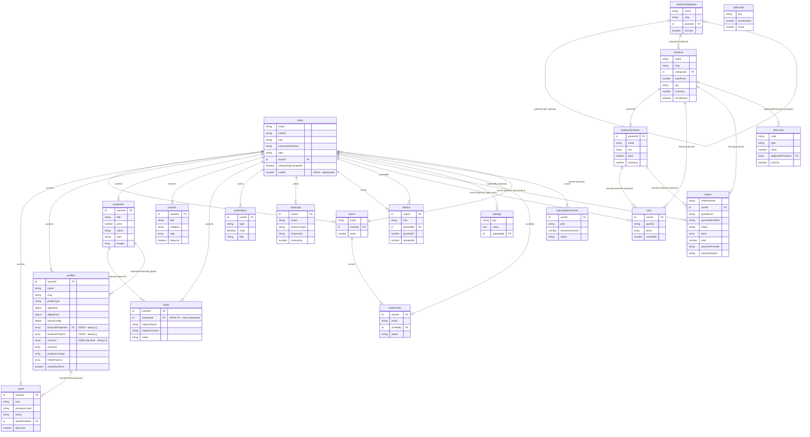

# Entity Relationship Diagram

All 20 tables from `convex/schema.ts`, with every relationship derived from an actual `v.id("...")`
reference in the schema (no inferred/guessed relationships). Cardinality follows Convex's guarantees
directly: the referenced side is always exactly one document (`||`, since a Convex `Id` always points at
zero-or-one existing document, and every FK here is used as "the row this belongs to"); the referencing
side is `|{` (one-or-many) when the FK field is required, or `o{` (zero-or-many) when it's
`v.optional(...)`.

Two relationships are flagged `(dead)` — they exist in the schema and would render as valid links, but
per the data-flow audit (`.superpowers/sdd/audit-dataflow.md`) they are never actually populated in
production. They're kept in the diagram because the FK is real schema, not because the relationship is
functionally alive — see `docs/handoff/03-DATABASE-SCHEMA.md` for the full explanation of each.

Attribute lists below are trimmed to identifying/FK fields for readability — the full field list, types,
optionality, and indexes for every table are in `docs/handoff/03-DATABASE-SCHEMA.md`.



## Reading notes

- **`users` ↔ `teams` is bidirectional by design, not a mistake.** `users.teamId` (optional) points a team
  member at their team; `teams.ownerId` (required) points a team at the user who owns it. Nothing in the
  schema enforces that the owner is also a member with `teamId` set to that same team — that's an
  application-level invariant, not a database constraint.
- **`admins` has two separate FKs to `users`** (`userId` — the admin being granted the role, and
  `grantedBy` — who granted it), both drawn as separate relationship lines above.
- **`productCategories.parentId` is a self-referencing FK** (optional), modeling nested categories.
- **Array-of-FK relationships** (`carts.items[].productId`, `orders.items[].productId`,
  `discounts.applicableProducts[]`, `profiles.featuredProperties[]`, etc.) are drawn as ordinary one-to-many
  edges labeled with the array path. Convex doesn't enforce referential integrity on these — an id inside a
  denormalized array (e.g. `orders.items[].productId`, which is a point-in-time snapshot of what was
  purchased) can outlive the referenced document being deleted.
- `rateLimits` has no `Id<...>` fields at all — its `key` is an arbitrary resource-scoped string
  (`activate:<userId>`, `lead:<ownerId>`, etc., see `docs/handoff/03-DATABASE-SCHEMA.md`), so it has no
  edges in this diagram. That's accurate, not an omission.
- Isolated-looking `settings` (only an optional `updatedBy` edge) is genuinely a low-connectivity
  key/value table — also accurate, not trimmed for space.

## SVG export (for Figma)

Generated with the Mermaid CLI directly from the same source above:

```bash
npx -y @mermaid-js/mermaid-cli -i erd.mmd -o docs/handoff/figma/erd.svg
```

This succeeded in this environment on the first attempt (no `npx playwright install chromium` was
needed — a Chromium build was already resolvable). Verified after generation, not just assumed:

- **Size**: 353,199 bytes — not empty, not a truncated/broken output.
- **Parses as XML**: loaded through `jsdom`'s `DOMParser` with the `image/svg+xml` MIME type; no
  `parsererror` node was produced, and the document's root element is `<svg>`.
- **Contains all 20 table names as literal text**: every one of `users`, `cards`, `profiles`,
  `properties`, `projects`, `leads`, `notifications`, `auditLogs`, `admins`, `productCategories`,
  `products`, `productVariations`, `carts`, `orders`, `discounts`, `settings`, `rateLimits`, `teams`,
  `teamInvites`, `subscriptionInvoices` appears in the file content (checked with a plain substring
  search over the raw SVG text, not just the visual render).
- The file's internal `viewBox` is `0 0 5250.21 2829.5` and its `<style>` block defines the standard
  Mermaid `erDiagram` classes (`entityBox`, `relationshipLine`, `relationshipLabelBox`), consistent with a
  real rendered ER diagram rather than an error placeholder — Mermaid renders parse failures as a visible
  "Syntax error" graphic with its own distinct markup, and no such marker string appears in the file.

**To import into Figma**: open a Figma file, drag `docs/handoff/figma/erd.svg` directly onto the canvas
(or Fileimport). It arrives as an editable vector layer tree with real, editable text nodes for every
table and field name — not a flattened raster image.
