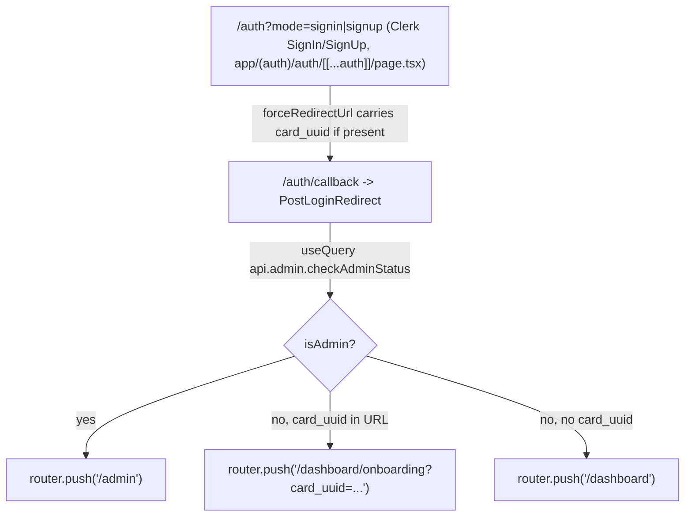
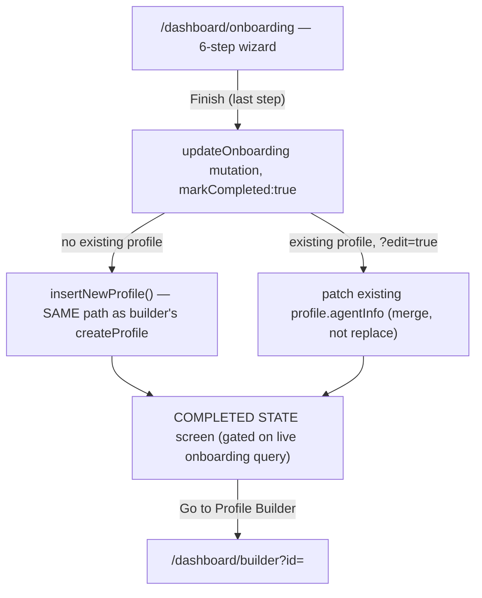
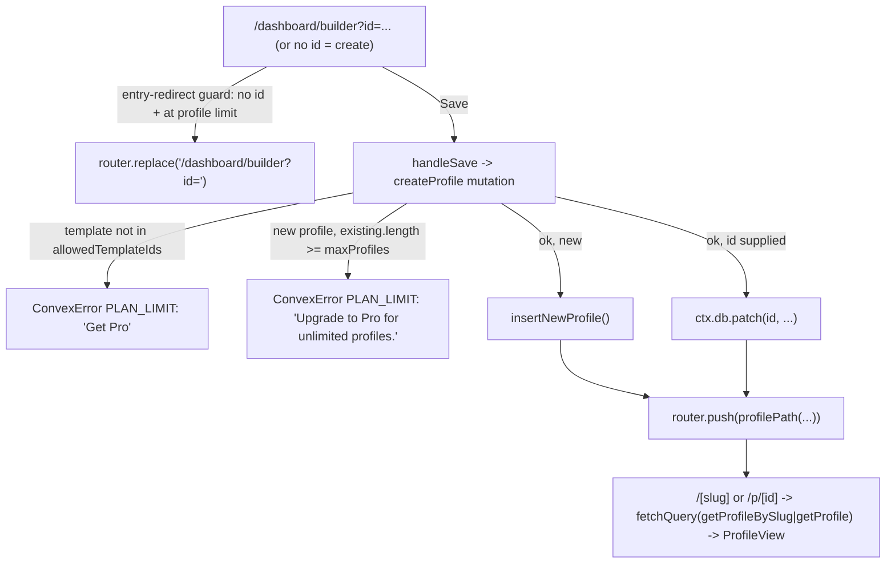
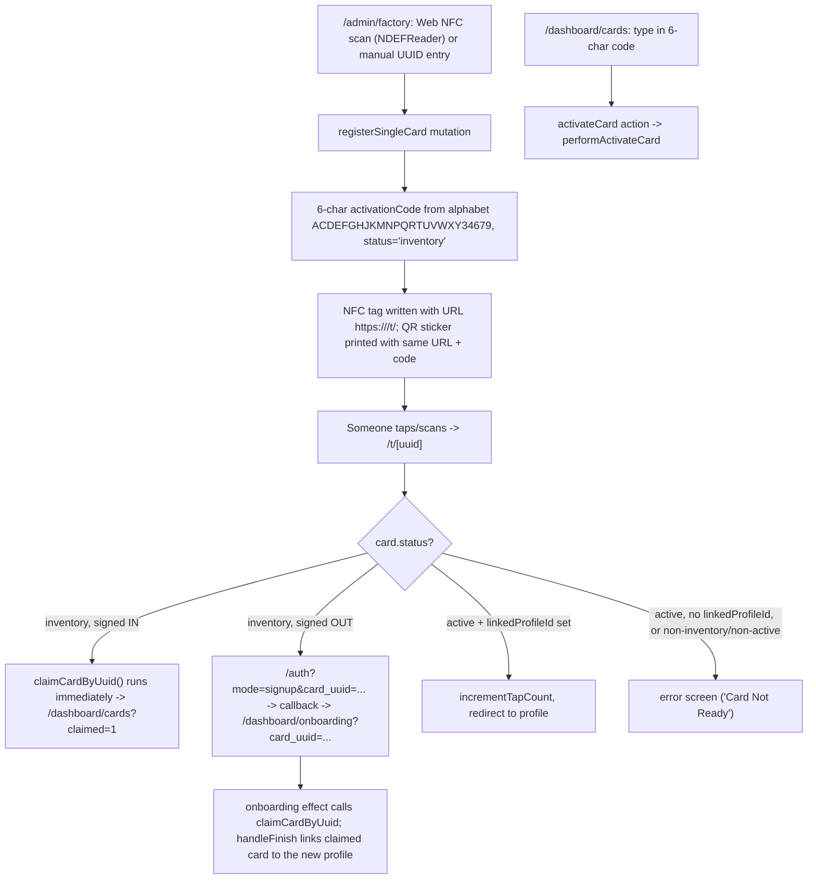
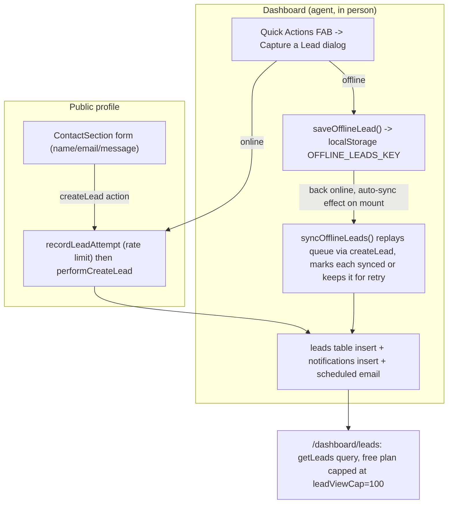
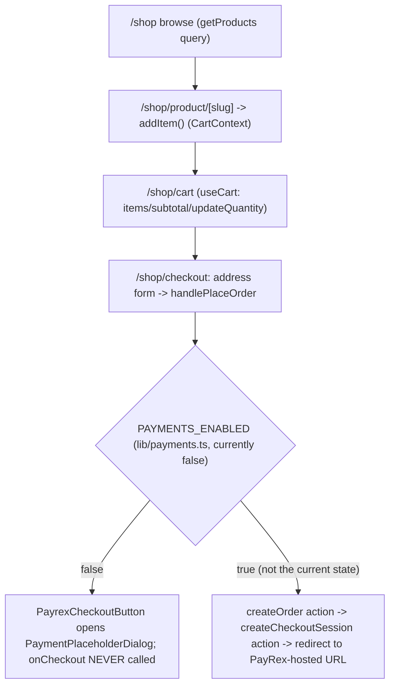
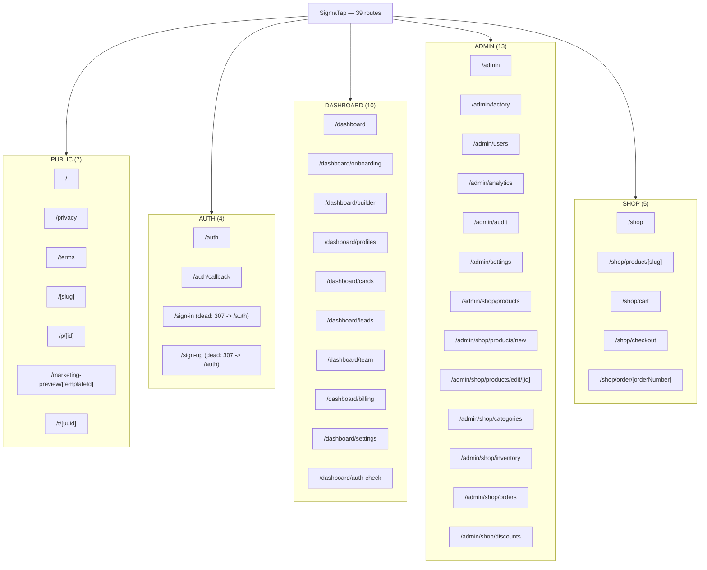

# User Flows

As of commit `4116d50` on `main` (this doc was written on a
branch based at that commit).

Every claim below was traced through the actual component/Convex code, not
inferred from product intuition — file:line citations are given so you can
verify or update them yourself as the code moves. Where I could not verify
something from source, it is marked `UNVERIFIED:`.

Companion diagrams for Figma (drag-and-drop import — see
`docs/handoff/figma/README.md`):
- `docs/handoff/figma/user-flows.svg` — all six flows below, one diagram.
- `docs/handoff/figma/sitemap.svg` — all 39 routes grouped by area.

## Plan gating cheat-sheet

Source of truth: `lib/plans.ts:36-105` (`PLAN_LIMITS`). Three plans —
`free`, `pro`, `business` — all defined in one record so nothing here is
guessed:

| Limit | Free | Pro | Business |
|---|---|---|---|
| `maxProfiles` | 1 | unlimited | unlimited |
| `maxActiveCards` | 1 | unlimited | unlimited |
| `allowedTemplateIds` | `["editorial", "architectural"]` only (`FREE_TEMPLATE_IDS`, `lib/plans.ts:31`) | all | all |
| `leadViewCap` | 100 (older leads still captured, just not viewable) | unlimited | unlimited |
| `showBranding` | true | false | false |
| `canExportLeads` | false | true | true |
| `hasTeam` | false | false | true (5 seats) |

These four numbers — profile count, active-card count, template id, lead
view cap — are the ones that actually change flow behavior below; each is
called out inline where it bites.

---

## 1. Sign-up / sign-in → `/auth/callback` → admin vs consumer split

- The single `/auth` page renders Clerk's `<SignIn>`/`<SignUp>` and always
  redirects to `/auth/callback` on success
  (`app/(auth)/auth/[[...auth]]/page.tsx:43-45,109-145`). If the visitor
  arrived from a card tap, `card_uuid` is appended to that redirect URL —
  the comment at lines 37-42 spells out why this is load-bearing: dropping
  it here silently breaks the entire QR activation chain, because
  `forceRedirectUrl` only fires on a *completed* Clerk auth flow and is the
  only place the uuid survives the hop.
- `/auth/callback` is a one-line wrapper around `PostLoginRedirect`
  (`app/(auth)/auth/callback/page.tsx:8-10`).
- `PostLoginRedirect` (`components/PostLoginRedirect.tsx:23-60`) queries
  `api.admin.checkAdminStatus` and branches three ways once it resolves:
  admin → `/admin`; non-admin with `card_uuid` → `/dashboard/onboarding?card_uuid=...`
  (so the onboarding page's claim effect can run, see Flow 4); non-admin
  otherwise → `/dashboard`.
- Once inside `/dashboard/**`, `DashboardLayout` re-checks admin status and
  bounces an admin **only on first landing at the bare `/dashboard` root**
  during the session, via `shouldRedirectAdminOnFirstLanding`
  (`lib/adminRedirect.ts:36-77`, wired in `app/dashboard/layout.tsx:383-390`).
  This is deliberately narrower than "every `/dashboard/**` route" — the doc
  comment at `lib/adminRedirect.ts:9-25` explains that the old broader rule
  trapped an admin who completed onboarding: every later visit to
  `/dashboard/builder?id=X` bounced them back to `/admin`, and the
  post-claim hand-off from `/t/[uuid]` (Flow 4) broke the same way. The
  narrower rule + `sessionStorage` flag lets an admin dogfood the full
  consumer app after using the "Back to user app" exit once per session.
- Dead routes: `/sign-in` and `/sign-up` (`app/sign-in/[[...sign-in]]/page.tsx`,
  `app/sign-up/[[...sign-up]]/page.tsx`) exist as files but `middleware.ts:38-40`
  unconditionally 307-redirects both paths to `/auth` before the page ever
  renders — grepping the repo for references to `'/sign-in'`/`'/sign-up'`
  outside those two files and `middleware.ts` turns up nothing. They are
  leftover Clerk-starter scaffolding, not a real entry point.

## 2. Onboarding wizard → first profile creation → builder

- Steps: welcome, type, identity, contact, work, photo
  (`app/dashboard/onboarding/page.tsx:75-82`). The wizard used to have a
  7th, wizard-internal "done" step whose Finish button didn't actually
  finish anything; that was removed — "photo" is now the last step and its
  own Finish button (`handleFinish`, lines 258-332) is what completes
  onboarding, per the Task 21 comment at lines 62-74.
- `handleFinish` calls `updateOnboarding({ ..., markCompleted: true })`
  (`app/dashboard/onboarding/page.tsx:261-274`), which is a single Convex
  mutation (`convex/users.ts:82-226`) that both patches the user's
  `onboardingData`/`onboardingCompleted` and, on first completion, creates
  the profile.
- **Onboarding completion and profile creation deliberately go through one
  path.** When there's no existing profile,
  `convex/users.ts:156-189` calls `insertNewProfile()` — the exact same
  helper the builder's `createProfile` mutation calls
  (`convex/profiles.ts:157-180`, called from `createProfile` at line 361).
  The doc comment at `convex/users.ts:150-155` explains why: an earlier
  version used a parallel `ctx.db.insert` here that never assigned a slug
  and never seeded a `digitalCard`. Default theme/colors/component order
  are derived from the wizard's `profileCategory`
  (`convex/users.ts:144-186`) — e.g. "individual" gets the `editorial`
  theme, "business" gets `architectural`.
- Editing (`?edit=true`, reached from the COMPLETED STATE screen's "Edit
  Profile Setup" button) re-runs the same mutation against the existing
  profile, but **merges** the wizard's fields onto the existing
  `agentInfo` rather than replacing it wholesale (`convex/users.ts:212-220`)
  — builder-only fields (socialLinks, certifications, gallery, etc.) the
  wizard's UI never asks for are preserved.
- If a card was claimed during onboarding (Flow 4), `handleFinish` also
  calls `linkProfile` to attach it to the just-created profile
  (`app/dashboard/onboarding/page.tsx:277-290`), non-blocking on failure.
- **Plan gating in this flow:** none directly — `updateOnboarding` never
  checks `maxProfiles`. The check happens one step later, the first time
  the user tries to *save* a second profile from the builder (Flow 3).

## 3. Profile builder edit → save → public profile render

- The builder page is large (2284 lines,
  `app/dashboard/builder/page.tsx`); the relevant pieces:
  - **Entry guard.** A "create" entry (no `?id=`) while already at the
    plan's profile limit is redirected to editing the newest existing
    profile instead of showing a form that can never save
    (`resolveBuilderEntryRedirect`, wired at
    `app/dashboard/builder/page.tsx:476-489`, comment explains the Task 12
    bug this fixes).
  - **Save.** `handleSave` (`app/dashboard/builder/page.tsx:869-999`)
    assembles the profile fields and calls `createProfile`
    (`convex/profiles.ts:182-363`) with `id: editingId ?? undefined`.
  - `createProfile` enforces two plan checks, in order:
    1. Template gating — `layoutConfig.themeId` must be in
       `limits.allowedTemplateIds` (`convex/profiles.ts:300-309`). Free
       plan can only pick `editorial`/`architectural`; `kinetic` is Pro+.
    2. Profile-count gating — **only when creating** (`!args.id`):
       existing profile count must be below `limits.maxProfiles`
       (`convex/profiles.ts:312-323`).
    Both throw `ConvexError({ code: "PLAN_LIMIT", ... })` rather than a
    plain `Error`, specifically so the message survives production's
    redaction of plain-Error text (see `lib/errors.ts`) and the client can
    detect it via `isPlanLimitError` (`lib/plans.ts:121`) to show a "Get
    Pro" action on the toast (`app/dashboard/builder/page.tsx:992-996`).
  - On success, the client navigates to `profilePath({ _id, slug })`
    (`lib/profileUrl.ts:19-21`) — `/<slug>` when the profile has one, else
    the stable `/p/<id>` fallback.
- **Public render.** Both `/[slug]/page.tsx:28-42` and
  `/p/[id]/page.tsx:26-37` are server components: they `fetchQuery` the
  profile at request time (via `convex/nextjs`), call `notFound()` if it's
  missing/reserved, and otherwise render the shared `ProfileView` client
  component with either `{ by: "slug", slug }` or `{ by: "id", profileId }`.
  `generateMetadata` on both pages also fetches the profile to build
  OpenGraph/Twitter tags from `agentInfo.fullName`/`title`/`about`.
  `isReservedSlug` (`lib/slug.ts`) guards `/[slug]` against colliding with
  real top-level routes like `/dashboard` or `/admin`.
- Free-plan profiles render with SigmaTap branding; paid plans do not, and
  this is computed server-side rather than stored on the profile document:
  `enrichProfile` (`convex/profiles.ts:56-113`, called from every
  profile-fetching query) looks up the profile owner, reads
  `planContext(owner).limits.showBranding`, and attaches the resulting
  boolean to the response — the comment at lines 57-59 notes this
  deliberately exposes only a cosmetic flag, never the owner's raw
  plan/expiry data, to a public/anonymous caller. `ProfileView` renders the
  "Powered by" footer when `profile.showBranding !== false`
  (`app/p/[id]/ProfileView.tsx:168`). Business-plan owners additionally get
  their team's `teamBranding` (company name/logo/accent) attached the same
  way (`convex/profiles.ts:71-81`).

## 4. NFC card lifecycle: register → tag → tap → claim → activation code → link

- **Registration.** `/admin/factory` supports both a Web NFC scan flow
  (Chrome/Android only — gated on `"NDEFReader" in window`,
  `app/admin/factory/page.tsx:107-232`) and manual UUID entry
  (`handleManualRegister`, lines 246-280). Both call
  `api.admin.registerSingleCard`.
- **Activation code generation is server-side, not client-side** — this is
  the single most important correctness fact in this flow. `registerSingleCard`
  (`convex/admin.ts:415-479`) generates a 6-character code from
  `ACTIVATION_ALPHABET = "ACDEFGHJKMNPQRTUVWXY34679"`
  (`convex/admin.ts:405`) — **uppercase only, with every lookalike glyph
  pair stripped (0/O, 1/I/L, 5/S, 8/B, 2/Z)**, because these codes get
  hand-typed off a small printed sticker. The doc comment at
  `convex/admin.ts:399-403` and the deprecated-but-still-accepted
  `activationCode` client arg (lines 419-425) both note the old
  client-generated `ACT-<serial>-<timestamp>` codes were 30-55 characters
  of mixed-case hex — never actually enterable in the 6-char activation
  form. Uniqueness is enforced by re-querying the `by_activationCode` index
  up to 10 times (`convex/admin.ts:450-459`).
- **The physical write.** The NFC tag is written with a URL only —
  `${PRODUCTION_DOMAIN}/t/${serialNumber}`
  (`app/admin/factory/page.tsx:145`) — where `PRODUCTION_DOMAIN` derives
  from `NEXT_PUBLIC_APP_URL` (falling back to `https://sigmatap.vercel.app`
  for local/dev, lines 70-72; the long comment above it documents a real
  incident where a frozen literal host went dead). The printed sticker's
  QR code encodes the identical URL (`QRCodeSVG value` at line 677) and
  also shows the 6-character code as plain text (lines 691-693), since the
  manual-entry fallback promises "the code on your card or its packaging."
- **`/t/[uuid]` behaves differently for signed-in vs signed-out visitors —
  by design, not by accident.** This is the crux of the whole chain
  (`app/t/[uuid]/page.tsx:55-105`, comment at lines 59-69): a signed-in
  visitor never actually runs Clerk's sign-up flow when routed through
  `/auth`, so `forceRedirectUrl` (the only place `card_uuid` survives)
  never fires and the uuid would be silently dropped. So: if `card.status
  === "inventory"` and the visitor `isSignedIn`, the page calls
  `claimCardByUuid` directly, right there, and redirects to
  `/dashboard/cards?claimed=1`. If signed out, it instead redirects to
  `/auth?mode=signup&card_uuid=...`, which starts the chain traced in Flow
  1 and lands on `/dashboard/onboarding?card_uuid=...`, whose own claim
  effect (`app/dashboard/onboarding/page.tsx:166-209`) calls
  `claimCardByUuid` once Clerk auth resolves.
- If the card is already `active` and has a `linkedProfileId`, the tap
  increments `tapCount` and redirects straight to the linked profile's
  `profilePath` (`app/t/[uuid]/page.tsx:90-104`, `convex/cards.ts:181-192`
  for `incrementTapCount`).
- **Claiming logic** (`convex/cards.ts:223-303`,
  `performClaimCardByUuid`): claimability is judged on `card.status`, *not*
  `ownerId` — factory registration stamps `ownerId` with the registering
  admin as a mandatory-but-custodial owner (schema requires one), so an
  ownerId-based gate would have rejected every factory-produced card. A
  card still `"inventory"` is claimable by anyone; once claimed it's
  patched to `{ ownerId: <claimer>, status: "active" }`. Rate-limited via a
  separate `recordClaimAttempt` internal mutation, committed independently
  of the throw-prone claim logic so retries genuinely accumulate toward
  the limit (comment at `convex/cards.ts:194-202`).
- **Manual activation-code path** (`/dashboard/cards`, not via QR): the
  user types the 6-character code; `handleActivate`
  (`app/dashboard/cards/page.tsx:108-129`) calls `api.cards.activateCard`,
  an action wrapping `performActivateCard`
  (`convex/cards.ts:63-114`), which normalizes the code to uppercase before
  an exact-match index lookup (with a raw-input fallback for legacy mixed-
  case codes, lines 71-86). The same page also offers a camera-based QR
  scan (`handleScanResult`, `app/dashboard/cards/page.tsx:132-152`) that
  claims by uuid directly (`claimCard`) when the scanned code decodes to a
  `/t/<uuid>` URL — bypassing code transcription entirely — and falls back
  to `activateCard` for a scanned code string.
- **Linking a card to a profile** happens via `linkProfile`
  (`convex/cards.ts:133-156`), called either automatically at the end of
  onboarding (Flow 2) or manually from `/dashboard/cards`
  (`handleLinkProfile`, `app/dashboard/cards/page.tsx:155-167`).
- **Plan gating in this flow:** free plan allows only 1 *active* card
  (`maxActiveCards: 1`). `assertCanActivateCard`
  (`convex/cards.ts:16-36`) is called from both the claim path
  (`performClaimCardByUuid`, line 293) and the manual-code path
  (`performActivateCard`, line 105) and throws `ConvexError({ code:
  "PLAN_LIMIT", ... })` once the free-plan cap is hit. `/t/[uuid]`'s error
  screen renders the `UpgradeGate` "Get Pro" banner instead of a dead-end
  when this specific error is caught (`app/t/[uuid]/page.tsx:114-119`,
  keyed via `isPlanLimitError`).

## 5. Lead capture: public contact form → lead → dashboard, including the offline queue

- **Public form.** `ContactSection` (`components/templates/sections/ContactSection.tsx:39-62`)
  is the "browse profile → send message" surface. On submit it calls
  `api.leads.createLead` directly, with no offline fallback — if the
  request fails, it just shows an inline error and lets the visitor retry
  manually (lines 56-58, `setErrorMessage("Failed to send message...")`).
  **Important distinction:** the offline queue described below is a
  *separate* feature, only in the dashboard's "capture a lead in person"
  flow — the public contact form never touches `lib/offline-leads.ts`.
- `createLead` is a Convex **action** (`convex/leads.ts:162-171`), not a
  mutation, wrapping two internal mutations for the same atomicity reason
  used elsewhere in this codebase: `recordLeadAttempt` commits the
  rate-limit write in its own transaction so it survives a later
  validation throw in `performCreateLead` (comment at `convex/leads.ts:58-72`).
- **Rate limiting is two-tier** (`convex/leads.ts:15-38`):
  `VISITOR_MAX = 5`/min keyed on `lead:${ownerId}:${visitorId}` — where
  `visitorId` is a random id persisted in `localStorage` per browser
  (`getOrCreateLeadVisitorId`, `lib/offline-leads.ts:97-106`) — plus an
  `OWNER_AGGREGATE_MAX = 30`/min backstop keyed on `lead:${ownerId}` alone,
  since `visitorId` is client-supplied and trivially rotatable.
- **Leads are never lost regardless of plan** — the comment at
  `convex/leads.ts:118-119` is explicit: the Free plan's `leadViewCap`
  (100) only limits how many are *viewable* in `getLeads`
  (`convex/leads.ts:173-210`), returning `lockedCount` for the rest so the
  UI can show an upgrade prompt without discarding data.
- On successful insert, `performCreateLead` also writes a `notifications`
  row and schedules `internal.email.sendLeadNotification` if the owner has
  an email on file (`convex/leads.ts:131-151`).
- **The offline queue** (`components/profile-builder/OfflineLeadCapture.tsx`,
  opened from the dashboard's Quick Actions FAB,
  `app/dashboard/layout.tsx:91-101,138-142`) is for an agent capturing a
  lead they just met in person, possibly with no signal. `saveOfflineLead`
  (`lib/offline-leads.ts:19-33`) pushes an unsynced record into
  `localStorage` under `OFFLINE_LEADS_KEY`
  (`lib/storage-keys.ts` — a "frozen legacy value," see
  `docs/handoff/03-DATABASE-SCHEMA.md`). When the browser comes back online
  and a Convex user is loaded, an effect auto-syncs
  (`OfflineLeadCapture.tsx` "Auto-sync" effect) by calling
  `syncOfflineLeads` (`lib/offline-leads.ts:113-171`), which replays each
  queued lead through the same `createLead` action, marks synced leads and
  clears them, and **deliberately leaves failed ones in place** for retry
  on the next sync rather than dropping them (comment at lines 164-167).

## 6. Shop: browse → cart → checkout → the `PAYMENTS_ENABLED` placeholder

**Live payment is intentionally disabled.** `PAYMENTS_ENABLED` is a single
boolean constant, currently `false`
(`lib/payments.ts:18`). The doc comment above it
(lines 1-17) is explicit about why: no payment gateway has been chosen
(PayRex is not committed), no keys are configured, and
`convex/billing.ts#createUpgradeCheckout`/`convex/payrex.ts`'s
`createCheckoutSession` both throw immediately —
`"PAYREX_SECRET_KEY is not configured"` — confirmed at `convex/payrex.ts:42-44`
and `convex/billing.ts:230-231`.

- **Browse → cart.** `/shop` queries `api.shop.getProducts`/`getCategories`
  (`app/shop/page.tsx:172,180`) and `addItem` from `CartContext`
  (line 177, 189) to add to cart from a product card. `/shop/cart` reads
  from the same `useCart()` context (`app/shop/cart/page.tsx:53`, backed by
  `contexts/CartContext.tsx`, which persists a guest cart id for
  unauthenticated shoppers, `getOrCreateGuestId`).
- **Checkout.** `/shop/checkout` (`app/shop/checkout/page.tsx`) has a
  `handlePlaceOrder` handler (lines 176-214) that bundles two Convex
  **actions**: `createOrder` (`api.checkout.createOrder`, line 86) — which
  creates the pending order and clears the cart server-side — followed by
  `createCheckoutSession` (`api.payrex.createCheckoutSession`, line 87),
  which would return a PayRex-hosted checkout URL to redirect to.
- **Both surfaces end in the same placeholder.** `handlePlaceOrder` is
  passed to `PayrexCheckoutButton` as its `onCheckout` prop, together with
  `paymentsEnabled={PAYMENTS_ENABLED}`
  (`app/shop/checkout/page.tsx:464-465`). `PayrexCheckoutButton`
  (`components/shop/PayrexCheckoutButton.tsx:47-59`) only calls
  `onCheckout` when `paymentsEnabled` is true; when false, it opens
  `PaymentPlaceholderDialog` and **never calls `onCheckout` at all** — so
  neither `createOrder` nor `createCheckoutSession` ever runs, the cart
  stays intact, and no unpayable pending order is created (this guarantee
  is spelled out in the doc comment at lines 1-27 of that file). The
  dialog's copy: *"We're finalizing our payment provider — online checkout
  isn't live yet. Your cart is saved..."* The same component/gate pattern
  is reused by `components/billing/PlanUpgradeButton.tsx` for the
  dashboard's "Upgrade to Pro" billing surface — both payment entry points
  in the app terminate in this placeholder today.
- **Plan gating in this flow:** none — the shop sells physical NFC cards
  to anyone, signed in or not (guest checkout is explicitly supported via
  `guestEmail`/`guestId`, `app/shop/checkout/page.tsx:186-187`); plan tiers
  gate the SaaS side (profiles/cards/templates/leads), not the storefront.
- Re-enabling the real flow is, by design, a one-line flip of
  `PAYMENTS_ENABLED` back to `true` — every call site already reads from
  that one constant (comment at `components/shop/PayrexCheckoutButton.tsx:24-26`).

---

## Sitemap (all 39 routes)

Full 39-route list, `find app -name page.tsx | sort`, grouped the same way
as the diagram above:

**Public (7)** — `app/page.tsx`, `app/privacy/page.tsx`,
`app/terms/page.tsx`, `app/[slug]/page.tsx`, `app/p/[id]/page.tsx`,
`app/marketing-preview/[templateId]/page.tsx`, `app/t/[uuid]/page.tsx`.

**Auth (4)** — `app/(auth)/auth/[[...auth]]/page.tsx`,
`app/(auth)/auth/callback/page.tsx`,
`app/sign-in/[[...sign-in]]/page.tsx` (dead, see Flow 1),
`app/sign-up/[[...sign-up]]/page.tsx` (dead, see Flow 1).

**Dashboard (10)** — `app/dashboard/page.tsx`,
`app/dashboard/onboarding/page.tsx`, `app/dashboard/builder/page.tsx`,
`app/dashboard/profiles/page.tsx`, `app/dashboard/cards/page.tsx`,
`app/dashboard/leads/page.tsx`, `app/dashboard/team/page.tsx`,
`app/dashboard/billing/page.tsx`, `app/dashboard/settings/page.tsx`,
`app/dashboard/auth-check/page.tsx`.

**Admin (13)** — `app/admin/page.tsx`, `app/admin/factory/page.tsx`,
`app/admin/users/page.tsx`, `app/admin/analytics/page.tsx`,
`app/admin/audit/page.tsx`, `app/admin/settings/page.tsx`,
`app/admin/shop/products/page.tsx`,
`app/admin/shop/products/new/page.tsx`,
`app/admin/shop/products/edit/[id]/page.tsx`,
`app/admin/shop/categories/page.tsx`, `app/admin/shop/inventory/page.tsx`,
`app/admin/shop/orders/page.tsx`, `app/admin/shop/discounts/page.tsx`.

**Shop (5)** — `app/shop/page.tsx`, `app/shop/product/[slug]/page.tsx`,
`app/shop/cart/page.tsx`, `app/shop/checkout/page.tsx`,
`app/shop/order/[orderNumber]/page.tsx`.

Route-level auth gating (not page-level): `middleware.ts:11-14` protects
`/dashboard(.*)` and `/admin(.*)` at the edge via `clerkMiddleware`;
everything else is public by default — the comment at `middleware.ts:4-10`
explains this is a deliberate deny-list, not an allow-list, because most
top-level segments are potential vanity profile slugs
(`app/[slug]/page.tsx`) that anonymous NFC-tap visitors must reach.
`/admin(.*)` additionally checks a Clerk session-claim role if one is
configured, but degrades (does not fail closed) if that dashboard
customization step was never done — `middleware.ts:53-80` — because the
real admin gate is server-side, in `app/admin/layout.tsx` and
`convex/authz.ts:requireAdmin`, called from every admin Convex function.

Not counted in the 39 (API routes, not pages): `app/api/health/route.ts`,
`app/api/webhooks/stripe/route.ts`, `app/api/webhooks/paypal/route.ts`.
