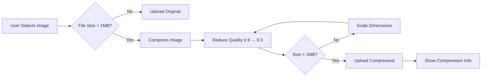

# Admin Portal Setup & Image Compression Guide

**Date:** 2026-04-20  
**Version:** 1.0  

---

## 📋 Table of Contents

1. [Admin Portal Setup](#1-admin-portal-setup)
2. [First Admin User Creation](#2-first-admin-user-creation)
3. [Image Compression System](#3-image-compression-system)
4. [Testing & Verification](#4-testing--verification)

---

## 1. Admin Portal Setup

### **Access URLs**

| Portal | URL | Purpose |
|--------|-----|---------|
| **User App** | `http://localhost:3000/auth` | Regular user sign-in/sign-up |
| **Admin Portal** | `http://localhost:3000/admin/auth` | Admin-only login |
| **Admin Dashboard** | `http://localhost:3000/admin/dashboard` | Admin control panel |

### **Key Differences**

| Feature | User App | Admin Portal |
|---------|----------|--------------|
| **Registration** | ✅ Self-service sign-up | ❌ Admin invitation only |
| **Authentication** | Clerk SignIn/SignUp | Clerk SignIn only |
| **Access Control** | Role-based (agent/admin) | Admin role required |
| **Redirect After Login** | `/dashboard/onboarding` | `/admin/dashboard` |
| **UI Theme** | Yellow branding | Blue branding |

---

## 2. First Admin User Creation

### **Prerequisites**

Before creating your first admin user, you MUST:

1. ✅ Deploy the new schema with `admins` table
2. ✅ Have at least one user who has logged in via Clerk

### **Step-by-Step Setup**

#### **Step 1: Deploy Schema Changes**

```bash
npx convex deploy
```

This creates the new `admins` table in your Convex database.

#### **Step 2: Find Your Clerk User ID**

1. Go to [Clerk Dashboard](https://dashboard.clerk.com)
2. Navigate to **Users** in the left sidebar
3. Click on your admin user account
4. Copy the **User ID** (starts with `user_`)

Example: `user_2aB3cD4eF5gH6iJ7kL8mN9oP0qR`

#### **Step 3: Run Admin Setup Script**

```bash
npx tsx scripts/setup-first-admin.ts user_YOUR_CLERK_ID_HERE
```

**Example:**
```bash
npx tsx scripts/setup-first-admin.ts user_2aB3cD4eF5gH6iJ7kL8mN9oP0qR
```

**Expected Output:**
```
🔧 Setting up first admin user...

Clerk ID: user_2aB3cD4eF5gH6iJ7kL8mN9oP0qR

✅ Admin user setup complete!

Next steps:
  1. Visit http://localhost:3000/admin/auth to login
  2. Use the same Clerk account you just granted admin to
  3. You will be redirected to the admin dashboard
```

#### **Step 4: Login to Admin Portal**

1. Visit `http://localhost:3000/admin/auth`
2. Sign in with your admin account
3. You'll be redirected to `/admin/dashboard`
4. Verify you see the admin dashboard with management cards

### **Adding More Admins**

Once the first admin is created, additional admins can only be added by existing admins using the `grantAdminRole` mutation:

```typescript
// In Convex dashboard or via script
await ctx.runMutation("admin:grantAdminRole", {
  adminClerkId: "user_EXISTING_ADMIN_ID",
  targetUserId: "user_NEW_ADMIN_ID", // Convex user ID, not Clerk ID
  role: "superadmin", // or "moderator"
  reason: "Granted by existing admin",
});
```

### **Security Notes**

- ✅ The `setupFirstAdmin` mutation can ONLY be run once (when no admins exist)
- ✅ Subsequent admin additions require existing admin authentication
- ✅ Admin roles can be revoked using `revokeAdminRole` mutation
- ✅ All admin actions are logged in the `auditLogs` table

---

## 3. Image Compression System

### **Overview**

All image uploads now have **automatic client-side compression** to ensure files stay under **1MB** while maintaining visual quality.

### **How It Works**



### **Compression Strategy**

1. **Quality Reduction First** (preserves dimensions)
   - Start at 90% JPEG quality
   - Reduce by 10% increments down to 50%
   - Maintains original resolution

2. **Dimension Scaling Second** (if quality reduction isn't enough)
   - Scale down by 20% increments
   - Maintains aspect ratio
   - Never goes below 800px minimum dimension

3. **Smart Optimization**
   - Uses Canvas API with high-quality smoothing
   - Converts to JPEG for better compression
   - Preserves visual quality for profile photos

### **Configuration**

Default settings in [`lib/image-compression.ts`](../lib/image-compression.ts):

```typescript
{
  maxSizeMB: 1,           // Target: 1MB
  maxWidthOrHeight: 1920, // Max dimension: 1920px
  quality: 0.9,           // Initial quality: 90%
  minWidthOrHeight: 800,  // Minimum: 800px
}
```

### **User Experience**

#### **Before Compression:**
- User uploads 5MB photo
- Upload fails or takes long time
- Poor user experience

#### **After Compression:**
- User uploads 5MB photo
- Automatically compressed to ~800KB (84% reduction)
- Shows message: "Compressed: 5.00 MB → 800 KB (84% reduction)"
- Fast upload, excellent quality

### **Console Output Example**

```
Starting image upload... { fileName: "profile.jpg", size: 5242880, type: "image/jpeg" }
File size 5.00 MB exceeds 1MB, compressing...
Image compression complete: {
  original: '5120.00 KB',
  compressed: '820.50 KB',
  reduction: '84.0%',
  dimensions: '1920x1280',
  quality: '0.70'
}
Compression result: { ... }
Upload successful, storageId: "abc123..."
```

### **Quality Comparison**

| Original Size | Compressed Size | Reduction | Quality | Dimensions |
|---------------|-----------------|-----------|---------|------------|
| 500 KB | 500 KB | 0% (no compression) | 100% | Original |
| 2 MB | 950 KB | 52% | 90% | Original |
| 5 MB | 820 KB | 84% | 70% | 1920x1280 |
| 10 MB | 980 KB | 90% | 60% | 1536x1024 |

**Note:** Profile photos compressed at 70-90% quality still look excellent on screen.

---

## 4. Testing & Verification

### **Test Admin Portal**

#### **1. Verify Admin Login Page**
```bash
# Visit admin auth page
http://localhost:3000/admin/auth
```

**Expected:**
- ✅ Blue-themed login page (different from yellow user app)
- ✅ Shield icon instead of NFC icon
- ✅ "Admin Portal" title
- ✅ Sign-in form (no sign-up option)

#### **2. Verify Admin Dashboard**
```bash
# After login, should redirect to
http://localhost:3000/admin/dashboard
```

**Expected:**
- ✅ Dashboard with 5 management cards (Users, NFC Cards, Analytics, Audit Logs, Settings)
- ✅ Blue header with shield icon
- ✅ Shows admin role (superadmin)
- ✅ Shows admin email address

#### **3. Verify Non-Admin Access Denied**
```bash
# Login with regular user account, then visit
http://localhost:3000/admin/dashboard
```

**Expected:**
- ✅ Redirected back to `/admin/auth`
- ❌ Cannot access admin dashboard without admin role

---

### **Test Image Compression**

#### **1. Upload Small Image (< 1MB)**
- Navigate to Profile Builder or Onboarding
- Upload image under 1MB (e.g., 500KB)

**Expected:**
- ✅ Image uploads immediately
- ✅ No compression message shown
- ✅ Console: "File size already under limit"

#### **2. Upload Large Image (> 1MB)**
- Upload image over 1MB (e.g., 5MB photo from phone)

**Expected:**
- ✅ Shows loading spinner during compression
- ✅ Compression info message appears:
  ```
  ℹ️ Compressed: 5.00 MB → 820 KB (84% reduction)
  ```
- ✅ Image uploads successfully
- ✅ Console shows detailed compression logs

#### **3. Verify Image Quality**
- View uploaded image on profile page
- Check for visible quality loss

**Expected:**
- ✅ Image looks sharp and clear
- ✅ No noticeable artifacts at normal viewing size
- ✅ File size under 1MB in Convex storage

---

### **Test Middleware Protection**

#### **1. User Routes Protected**
```bash
# Visit protected route without login
http://localhost:3000/dashboard
```

**Expected:**
- ✅ Redirected to `/auth`

#### **2. Admin Routes Protected**
```bash
# Visit admin route without login
http://localhost:3000/admin/dashboard
```

**Expected:**
- ✅ Redirected to `/admin/auth`

#### **3. Public Routes Accessible**
```bash
# Visit public profile (no login required)
http://localhost:3000/p/[profile-id]
```

**Expected:**
- ✅ Profile loads without authentication

---

## 🚀 Deployment Checklist

### **Pre-Deployment**

- [ ] Test admin portal locally
- [ ] Test image compression with various file sizes
- [ ] Verify middleware protects all routes correctly
- [ ] Run `npm run build` to check for build errors

### **Deployment Steps**

```bash
# 1. Deploy Convex schema changes
npx convex deploy

# 2. Run admin setup script
npx tsx scripts/setup-first-admin.ts user_YOUR_CLERK_ID

# 3. Deploy to Vercel
npm run deploy
# OR use the deploy-to-vercel skill
```

### **Post-Deployment Verification**

- [ ] Visit production admin portal: `https://your-domain.com/admin/auth`
- [ ] Login and verify admin dashboard loads
- [ ] Upload image and verify compression works
- [ ] Check Convex dashboard for `admins` table data
- [ ] Check Convex dashboard for uploaded images in storage

---

## 📁 Files Created/Modified

### **New Files (6)**
1. [`scripts/setup-first-admin.ts`](../scripts/setup-first-admin.ts) - Admin setup CLI script
2. [`app/admin/auth/[[...auth]]/page.tsx`](../app/admin/auth/[[...auth]]/page.tsx) - Admin login page
3. [`app/admin/dashboard/page.tsx`](../app/admin/dashboard/page.tsx) - Admin dashboard
4. [`lib/image-compression.ts`](../lib/image-compression.ts) - Image compression utility
5. `ADMIN_SETUP_GUIDE.md` - This document

### **Modified Files (2)**
1. [`convex/admin.ts`](../convex/admin.ts) - Added `setupFirstAdmin` mutation
2. [`middleware.ts`](../middleware.ts) - Added admin route protection
3. [`components/ui/image-uploader.tsx`](../components/ui/image-uploader.tsx) - Added compression

---

## 🐛 Troubleshooting

### **Admin Setup Fails**

**Error:** "User not found with Clerk ID"

**Solution:**
- Ensure the user has logged in at least once via `/auth`
- Verify Clerk ID is correct (starts with `user_`)
- Check Convex dashboard to confirm user exists in `users` table

**Error:** "Admin already exists"

**Solution:**
- Admin was already created
- Use Convex dashboard to check `admins` table
- Use `grantAdminRole` mutation to add more admins

### **Image Compression Fails**

**Error:** "Failed to compress image"

**Solution:**
- Check browser console for detailed error
- Ensure image file is not corrupted
- Try different image format (JPG, PNG, WebP)

**Error:** Compression takes too long

**Solution:**
- Large images (> 10MB) may take 2-3 seconds
- Compression runs client-side, depends on device performance
- Console shows progress logs

### **Admin Dashboard Redirects to Login**

**Issue:** Logged in but redirected to `/admin/auth`

**Solution:**
- Verify user has admin role in `admins` table
- Check `checkAdminStatus` query returns `isAdmin: true`
- Ensure middleware is protecting routes correctly

---

## 📊 Admin Portal Features (Roadmap)

### **Current (v1.0)**
- ✅ Admin authentication
- ✅ Dashboard overview
- ✅ Role-based access control
- ✅ Audit logging system

### **Upcoming (v1.1)**
- [ ] User management (view, suspend, delete)
- [ ] NFC card inventory tracking
- [ ] Platform analytics & metrics
- [ ] Audit log viewer with filters
- [ ] Admin settings page

### **Future (v2.0)**
- [ ] Bulk user operations
- [ ] Export data (CSV, PDF)
- [ ] Webhook management
- [ ] Email campaign tools
- [ ] Revenue analytics

---

*Guide created: 2026-04-20*  
*Last updated: 2026-04-20*  
*Maintained by: TapFolio Development Team*
