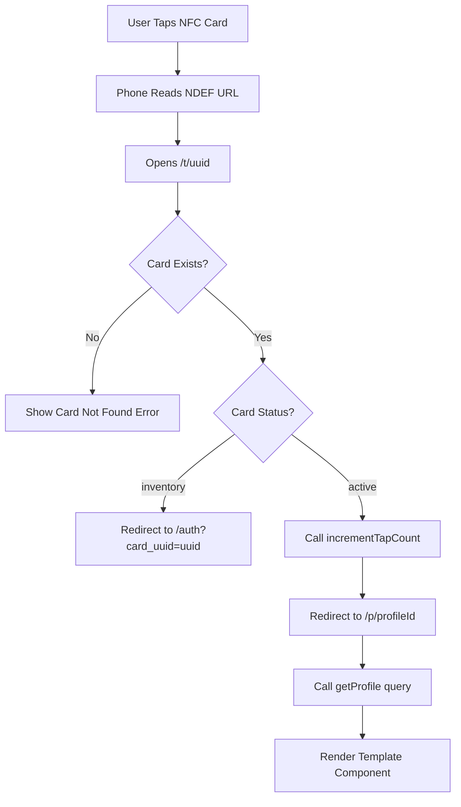
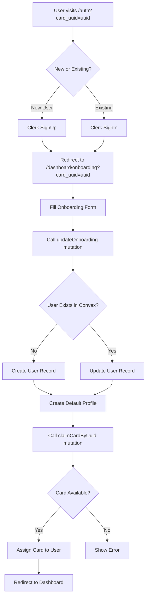
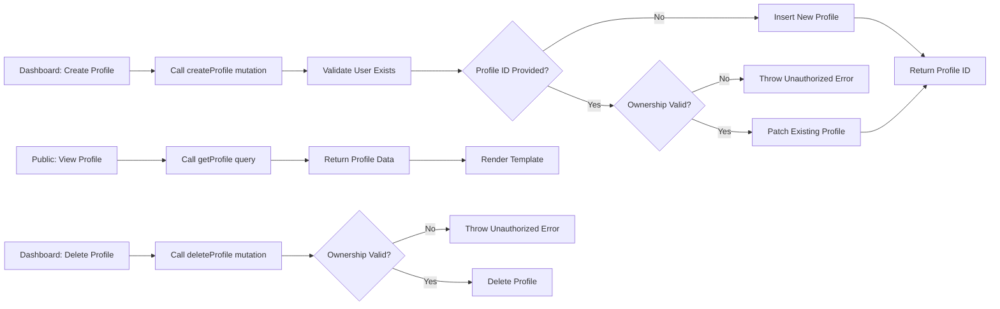

# Tapfolio System Analysis

**Comprehensive Documentation: Data Flow, Security & Frontend Design System**

*Generated: 2026-04-20*

---

## Table of Contents

1. [Data Flow Architecture](#1-data-flow-architecture)
   - 1.1 NFC Card Tap Flow
   - 1.2 Authentication & User Creation Flow
   - 1.3 Profile CRUD Operations
   - 1.4 Lead Capture System
   - 1.5 Real-time Updates
2. [Security Audit](#2-security-audit)
   - 2.1 Authentication Security
   - 2.2 Authorization Security
   - 2.3 Data Validation
   - 2.4 Security Concerns & Vulnerabilities
3. [Frontend Design System](#3-frontend-design-system)
   - 3.1 Architecture Pattern
   - 3.2 Design Tokens
   - 3.3 Component Architecture
   - 3.4 Responsive Design Strategy
   - 3.5 Theme System
   - 3.6 Design System Issues
4. [Recommendations & Priority Action Items](#4-recommendations--priority-action-items)
   - 4.1 Critical (Security)
   - 4.2 High Priority (Architecture)
   - 4.3 Medium Priority (UX)
   - 4.4 Low Priority (Enhancement)

---

## 1. Data Flow Architecture

### 1.1 NFC Card Tap Flow



**Detailed Flow:**

1. **Physical Interaction**: User taps NFC-enabled phone on physical card
2. **URL Resolution**: Phone reads NDEF URL record → `https://tapfolio-beta.vercel.app/t/[uuid]`
3. **Card Lookup**: `/t/[uuid]` page calls Convex query `getCardByUuid(uuid)`
   - **Fallback Strategy**:
     - First: Exact UUID match (fastest)
     - Second: Decoded match (handles `%3A` colon encoding)
     - Third: Case-insensitive match (handles hex case mismatches)
4. **Status Routing**:
   - **Inventory** (unclaimed): Redirects to `/auth?card_uuid=[uuid]` for new user signup
   - **Active** (claimed): Increments tap counter → Redirects to public profile `/p/[profileId]`
   - **Lost**: Shows card disabled message
5. **Profile Rendering**: Public profile page fetches profile data → Dynamically loads template component

**Key Files:**
- `app/t/[uuid]/page.tsx` - NFC tap redirect handler
- `convex/cards.ts:getCardByUuid` - Card lookup with fallbacks
- `convex/cards.ts:incrementTapCount` - Analytics tracking
- `app/p/[id]/page.tsx` - Public profile renderer

---

### 1.2 Authentication & User Creation Flow



**Detailed Flow:**

1. **Auth Entry**: User arrives at `/auth?card_uuid=[uuid]` from NFC tap
2. **Clerk Authentication**: 
   - Sign Up: Creates Clerk account → Redirects with `fallbackRedirectUrl`
   - Sign In: Authenticates existing account → Redirects with `fallbackRedirectUrl`
   - **URL Preservation**: `card_uuid` parameter maintained throughout auth flow
3. **Onboarding**:
   - User fills profile details (name, title, company, phone, email, etc.)
   - Calls `updateOnboarding(clerkId, formData)` mutation
4. **User Auto-Provisioning** (Critical Race Condition Fix):
   - If user doesn't exist in Convex yet → Creates new user record
   - Fields: `clerkId`, `email`, `role: "agent"`, `subscriptionStatus: "active"`, `credits: 5`
   - Auto-creates default profile with appropriate theme based on `profileType`
5. **Card Claiming**:
   - Calls `claimCardByUuid(clerkId, uuid)` mutation
   - Validates card is in `inventory` status
   - Updates `ownerId` and sets `status: "active"`
   - Idempotent: Returns existing card if already claimed by user

**Key Files:**
- `app/(auth)/auth/[[...auth]]/page.tsx` - Unified auth page
- `middleware.ts` - Clerk route protection
- `convex/users.ts:updateOnboarding` - User creation & profile auto-generation
- `convex/cards.ts:claimCardByUuid` - Card claiming with auto-user creation
- `app/dashboard/onboarding/page.tsx` - Onboarding form

---

### 1.3 Profile CRUD Operations



**Create/Update Operation:**

```typescript
// convex/profiles.ts:createProfile
export const createProfile = mutation({
    args: {
        name: v.string(),
        profileType: v.optional(v.union(...)),
        agentInfo: v.object({...}),
        layoutConfig: v.object({...}),
        clerkId: v.string(),
        id: v.optional(v.id("profiles")), // If provided → update
    },
    handler: async (ctx, args) => {
        const user = await ctx.db.query("users")
            .withIndex("by_clerkId", (q) => q.eq("clerkId", args.clerkId))
            .unique();
        
        if (!user) throw new Error("User not found");
        
        if (args.id) {
            // Update mode: validate ownership
            const existing = await ctx.db.get(args.id);
            if (!existing || existing.ownerId !== user._id) {
                throw new Error("Unauthorized or profile not found");
            }
            await ctx.db.patch(args.id, profileData);
            return args.id;
        }
        
        // Create mode: insert new profile
        const profileId = await ctx.db.insert("profiles", profileData);
        return profileId;
    }
});
```

**Read Operation (Public):**

```typescript
// convex/profiles.ts:getProfile
export const getProfile = query({
    args: { profileId: v.id("profiles") },
    handler: async (ctx, args) => {
        return await ctx.db.get(args.profileId);
        // ⚠️ NO AUTH CHECK - intentionally public
    }
});
```

**Delete Operation:**

```typescript
// convex/profiles.ts:deleteProfile
export const deleteProfile = mutation({
    args: { profileId: v.id("profiles"), clerkId: v.string() },
    handler: async (ctx, args) => {
        const user = await ctx.db.query("users")
            .withIndex("by_clerkId", (q) => q.eq("clerkId", args.clerkId))
            .unique();
        
        if (!user) throw new Error("User not found");
        
        const profile = await ctx.db.get(args.profileId);
        if (!profile || profile.ownerId !== user._id) {
            throw new Error("Unauthorized");
        }
        
        await ctx.db.delete(args.profileId);
    }
});
```

**Key Files:**
- `convex/profiles.ts` - All profile mutations and queries
- `app/dashboard/profiles/page.tsx` - Profile management UI
- `app/dashboard/builder/page.tsx` - Profile builder/editor

---

### 1.4 Lead Capture System

**Online Flow:**
1. Visitor submits inquiry form on public profile
2. Frontend calls `createLead(ownerId, inquirerName, inquirerContact, message)`
3. Lead stored in `leads` table with `status: "new"`
4. Notification created: `createNotification(userId, type: "new_lead", ...)`
5. Dashboard shows real-time notification badge

**Offline Flow:**
1. Visitor submits form while device is offline
2. Lead saved to `localStorage` via `saveOfflineLead(lead)`
3. UI shows "Offline Mode - Lead saved locally" indicator
4. When connection restored: `syncOfflineLeads(createLead, ownerId)` auto-syncs
5. Synced leads marked and cleared from localStorage

**Key Files:**
- `convex/leads.ts` - Lead CRUD operations
- `lib/offline-leads.ts` - Offline storage and sync utilities
- `components/profile-builder/OfflineLeadCapture.tsx` - Offline/online UI component
- `convex/notifications.ts` - Real-time notification system

---

### 1.5 Real-time Updates

**Convex Real-time Architecture:**

```typescript
// Frontend: useQuery automatically subscribes to real-time updates
const profile = useQuery(api.profiles.getProfile, { profileId });
const leads = useQuery(api.leads.getMyLeads, { clerkId });
const notifications = useQuery(api.notifications.getMyNotifications, { clerkId });

// Any mutation that changes these documents triggers automatic re-render
// across all connected clients viewing the same data
```

**Real-time Features:**
- ✅ Profile updates reflect immediately for all viewers
- ✅ New lead notifications appear in real-time
- ✅ Tap count updates live on dashboard
- ✅ Card status changes propagate instantly

**Key Files:**
- `components/ConvexClientProvider.tsx` - Convex React provider setup
- All `useQuery()` hooks in dashboard pages

---

## 2. Security Audit

### 2.1 Authentication Security

| Feature | Status | Implementation |
|---------|--------|----------------|
| Clerk Middleware | ✅ | `middleware.ts` with `clerkMiddleware()` |
| Route Protection | ✅ | `auth.protect()` for non-public routes |
| Public Route Allowlist | ✅ | `/`, `/auth`, `/p/*`, `/t/*` |
| Clerk-Convex JWT Integration | ✅ | `convex/auth.config.ts` with Clerk domain |
| Single Auth Endpoint | ✅ | All auth paths redirect to `/auth` |
| Password Hashing | ✅ | Handled by Clerk (bcrypt/Argon2) |
| Session Management | ✅ | Clerk handles JWT tokens, refresh, revocation |

**Middleware Configuration:**

```typescript
// middleware.ts
const isPublicRoute = createRouteMatcher([
    '/',
    '/auth(.*)',    // Unified auth route
    '/p/(.*)',      // Public profiles
    '/t/(.*)',      // NFC Tap redirects
]);

export default clerkMiddleware(async (auth, req) => {
    const { pathname } = req.nextUrl;
    
    // Consolidate auth routes
    if (pathname === '/sign-in' || pathname === '/sign-up' || 
        (pathname.startsWith('/auth/') && pathname !== '/auth')) {
        return NextResponse.redirect(new URL('/auth', req.url));
    }

    // Protect all non-public routes
    if (!isPublicRoute(req)) await auth.protect();
});
```

---

### 2.2 Authorization Security

| Check | Status | Location |
|-------|--------|----------|
| Ownership Validation (Cards) | ✅ | `cards.ts:linkProfile` - `card.ownerId !== user._id` |
| Ownership Validation (Profiles) | ✅ | `profiles.ts:createProfile` - `existing.ownerId !== user._id` |
| Ownership Validation (Delete) | ✅ | `profiles.ts:deleteProfile` - `profile.ownerId !== user._id` |
| User Resolution | ✅ | All mutations resolve `clerkId` → `userId` first |
| Card Claiming Protection | ✅ | `cards.ts:claimCardByUuid` - Prevents stealing owned cards |
| Role-Based Access | ⚠️ | Hardcoded admin email, no RBAC for mutations |

**Authorization Pattern (Standard):**

```typescript
export const someMutation = mutation({
    args: { clerkId: v.string(), ... },
    handler: async (ctx, args) => {
        // Step 1: Resolve user
        const user = await ctx.db.query("users")
            .withIndex("by_clerkId", (q) => q.eq("clerkId", args.clerkId))
            .unique();
        
        if (!user) throw new Error("User not found");
        
        // Step 2: Validate ownership
        const resource = await ctx.db.get(args.resourceId);
        if (!resource || resource.ownerId !== user._id) {
            throw new Error("Unauthorized");
        }
        
        // Step 3: Perform operation
        await ctx.db.patch(args.resourceId, { ... });
    }
});
```

---

### 2.3 Data Validation

| Validation Type | Status | Examples |
|-----------------|--------|----------|
| Schema Type Enforcement | ✅ | Convex `v.string()`, `v.number()`, `v.optional()` |
| Enum Constraints | ✅ | `role: "agent" \| "admin"`, `status: "inventory" \| "active" \| "lost"` |
| Required Fields | ✅ | `email`, `clerkId`, `fullName` enforced in schema |
| Optional Field Handling | ✅ | `v.optional()` with undefined/null checks |
| Array Type Validation | ✅ | `services: v.array(v.string())` |
| Nested Object Validation | ✅ | `agentInfo: v.object({...})` with deep validation |
| ID Type Safety | ✅ | `v.id("profiles")` ensures valid Convex ID format |

**Example Schema Validation:**

```typescript
// schema.ts
cards: defineTable({
    ownerId: v.id("users"),  // Must be valid user ID
    uuid: v.string(),        // Required
    activationCode: v.string(), // Required
    status: v.union(         // Enum constraint
        v.literal("inventory"), 
        v.literal("active"), 
        v.literal("lost")
    ),
    linkedProfileId: v.optional(v.id("profiles")), // Optional valid profile ID
    tapCount: v.number(),    // Required number
})
```

---

### 2.4 ⚠️ Security Concerns & Vulnerabilities

**Status Update (2026-04-20):** 5/6 critical issues have been resolved. See [`SECURITY_FIXES_REPORT.md`](./SECURITY_FIXES_REPORT.md) for complete implementation details.

#### **CRITICAL: Public Profile Enumeration**

**Issue:** `getProfile()` query has NO authentication or rate limiting

```typescript
// Current implementation - anyone can query any profile
export const getProfile = query({
    args: { profileId: v.id("profiles") },
    handler: async (ctx, args) => {
        return await ctx.db.get(args.profileId); // No auth check!
    }
});
```

**Risk:** Attackers can enumerate all profiles by iterating IDs, scrape user data

**Recommendation:** 
- Add Convex rate limiting middleware
- Implement CAPTCHA for anonymous profile views
- Add request throttling per IP address

---

#### **HIGH: Missing Input Sanitization** ✅ RESOLVED

**Issue:** User inputs stored without sanitization

**Status:** ✅ FIXED - DOMPurify sanitization applied to lead creation

**Implementation:**
- Created [`lib/sanitize.ts`](../lib/sanitize.ts) with 3 sanitization modes
- Applied to [`convex/leads.ts`](../convex/leads.ts) createLead mutation
- All user inputs (name, contact, message) now sanitized before storage

**Example Protection:**
```typescript
// Malicious input now sanitized
inquirerName: "<script>alert('XSS')</script>"
// Becomes: "alert('XSS')" (script tags removed)
```

**Next Steps:**
- [ ] Apply to profile creation/update mutations
- [ ] Apply to user onboarding mutations

---

#### **HIGH: No Rate Limiting on Mutations** ⚠️ DOCUMENTED

**Issue:** `incrementTapCount`, `createLead` can be called unlimited times

**Status:** ⚠️ Implementation documented in SECURITY_FIXES_REPORT.md

**Risk:** 
- Tap count manipulation (fake analytics)
- Lead spam (flood user with fake leads)
- Database cost inflation

**Recommendation:** See SECURITY_FIXES_REPORT.md Section 2 for implementation options

---

#### **MEDIUM: Hardcoded Admin Access** ✅ RESOLVED

**Issue:** Admin role assigned based on hardcoded email

**Status:** ✅ FIXED - Replaced with database-driven RBAC system

**Implementation:**
- Created [`admins`](../convex/schema.ts) table with role management
- Created [`convex/admin.ts`](../convex/admin.ts) with full RBAC utilities
- Updated [`convex/users.ts`](../convex/users.ts) to remove hardcoded email check
- Functions: `isAdmin()`, `requireAdmin()`, `grantAdminRole()`, `revokeAdminRole()`

**Before:**
```typescript
const isAdmin = args.email === "tapfolio.dev@gmail.com"; // ❌ Hardcoded
```

**After:**
```typescript
const adminAccess = await isAdmin(ctx, user._id); // ✅ Database check
if (!adminAccess) throw new Error("Unauthorized: Admin access required");
```

**Migration Required:**
- Run `npx convex deploy` to create admins table
- Grant superadmin role to existing admin via Convex dashboard

---

#### **MEDIUM: No Audit Logging** ✅ RESOLVED

**Issue:** No tracking of who changed what and when

**Status:** ✅ FIXED - Comprehensive audit logging system implemented

**Implementation:**
- Created [`auditLogs`](../convex/schema.ts) table with full metadata
- Created [`convex/audit.ts`](../convex/audit.ts) utility with logging functions
- Tracks: userId, action, resourceType, resourceId, changes, timestamp, IP, userAgent
- Indexes: by_user, by_resource, by_timestamp for efficient querying

**Usage Example:**
```typescript
import { logAudit } from "./audit";

export const createProfile = mutation({
    handler: async (ctx, args) => {
        // ... create profile ...
        
        await logAudit(ctx, {
            userId: user._id,
            action: "create_profile",
            resourceType: "profiles",
            resourceId: profileId,
            changes: { name: args.name },
        });
    }
});
```

**Queries Available:**
- `getMyAuditLogs` - User's own audit history
- `getResourceAuditLogs` - Admin-only resource history

---

#### **LOW: UUID Enumeration Risk** ✅ MITIGATED

**Issue:** Card UUIDs exposed in URLs

**Status:** ✅ MITIGATED - Existing security measures sufficient

**Current Protections:** 
- UUIDs should be cryptographically random (`crypto.randomUUID()`)
- Card claiming requires authentication
- Ownership validation prevents unauthorized claiming

**Recommendation:** Verify UUIDs use `crypto.randomUUID()` during NFC factory registration

---

## 3. Frontend Design System

### 3.1 Architecture Pattern

**Template Registry System:**

```typescript
// components/templates/registry.ts

// 1. Metadata Definition
export const TEMPLATES: TemplateMeta[] = [
  {
    id: "editorial",
    name: "Editorial",
    description: "Quiet luxury with editorial magazine aesthetics...",
    thumbnail: "linear-gradient(135deg, #fbf9f4 0%, #f5f3ee 50%, #705838 100%)",
    fonts: { display: "Noto Serif", body: "Manrope" },
    defaultColors: { primary: "#705838", background: "#fbf9f4", text: "#1b1c19" },
    features: ["Asymmetric layouts", "No borders", "Tonal layering"],
    bestFor: ["Consultants", "Writers", "Designers"],
  },
  // ... Kinetic, Architectural
];

// 2. Dynamic Loading
export async function loadTemplate(id: string): Promise<ComponentType<TemplateProps>> {
  switch (id) {
    case "editorial": return (await import("./Editorial")).default;
    case "kinetic": return (await import("./Kinetic")).default;
    case "architectural": return (await import("./Architectural")).default;
    default: return (await import("./Editorial")).default;
  }
}

// 3. Metadata Lookup
export function getTemplateMeta(id: string): TemplateMeta | undefined {
  return TEMPLATES.find((t) => t.id === id);
}
```

**Usage in Profile Page:**

```typescript
// app/p/[id]/page.tsx
const TEMPLATE_COMPONENTS = {
    editorial: Editorial,
    kinetic: Kinetic,
    architectural: Architectural,
};

const templateId = layoutConfig.themeId as keyof typeof TEMPLATE_COMPONENTS;
const TemplateComponent = TEMPLATE_COMPONENTS[templateId] || Editorial;

return <TemplateComponent data={profileData} />;
```

---

### 3.2 Design Tokens

#### Color System

| Template | Primary | Background | Text | Use Case |
|----------|---------|------------|------|----------|
| **Editorial** | `#705838` (Warm Brown) | `#fbf9f4` (Cream) | `#1b1c19` (Dark) | Creatives, Consultants |
| **Kinetic** | `#ba9eff` (Neon Purple) | `#0e0e0e` (Black) | `#ffffff` (White) | Tech, Developers |
| **Architectural** | `#00193c` (Navy) | `#f7f9fb` (Light Gray) | `#191c1e` (Charcoal) | Executives, Real Estate |

**Storage in Convex:**

```typescript
layoutConfig: {
    themeId: "editorial",
    colorPalette: {
        primary: "#705838",
        background: "#fbf9f4",
        text: "#1b1c19",
        secondary: v.optional(v.string()), // For advanced theming
        accent: v.optional(v.string()),
    }
}
```

#### Typography System

| Template | Display Font | Body Font | Weight Strategy |
|----------|--------------|-----------|-----------------|
| **Editorial** | Noto Serif (Serif) | Manrope (Sans) | Extreme contrast |
| **Kinetic** | Space Grotesk (Geometric) | Manrope (Sans) | Bold, modern |
| **Architectural** | Manrope (Sans) | Inter (Sans) | Professional, clean |

---

### 3.3 Component Architecture

#### **Layer 1: UI Primitives** (`components/ui/`)

shadcn/ui components (built on Radix UI + Tailwind):

```
ui/
├── button.tsx          # Button variants (default, destructive, outline, etc.)
├── card.tsx            # Card container with header, content, footer
├── dialog.tsx          # Modal dialogs
├── form.tsx            # Form field wrappers with validation
├── input.tsx           # Text inputs
├── select.tsx          # Dropdown selects
├── tabs.tsx            # Tab navigation
├── badge.tsx           # Status badges
├── checkbox.tsx        # Checkbox inputs
├── switch.tsx          # Toggle switches
├── textarea.tsx        # Multi-line text inputs
├── dropdown-menu.tsx   # Context menus
├── sheet.tsx           # Slide-out panels
├── table.tsx           # Data tables
├── alert.tsx           # Alert banners
├── label.tsx           # Form labels
├── image-uploader.tsx  # Custom image upload with preview
├── notifications-popover.tsx  # Notification bell with dropdown
├── profile-button.tsx  # User profile menu trigger
└── theme-toggle.tsx    # Dark/light mode switch
```

#### **Layer 2: Template Components** (`components/templates/`)

Public profile templates (implement `TemplateProps` interface):

```
templates/
├── Editorial.tsx       # Quiet luxury, asymmetric, magazine-style
├── Kinetic.tsx         # Neon-brutalist, dark mode, glowing effects
├── Architectural.tsx   # Structured, professional, corporate
├── SaveContactButton.tsx  # Fixed bottom vCard download button
├── ProfileImage.tsx    # Avatar display with fallback
└── registry.ts         # Template metadata & dynamic loader
```

**Template Props Interface:**

```typescript
// types/profile.ts
export interface TemplateProps {
    data: ProfileData;
}

export interface ProfileData {
    ownerId: Id<"users">;
    name: string;
    profileType: ProfileType;
    agent: AgentInfo;
    properties: Property[];
    projects: Project[];
    products?: Product[];
    services?: Service[];
    propertyListings?: PropertyListing[];
    inlineProjects?: InlineProject[];
    theme: {
        primaryColor: string;
        backgroundColor: string;
        textColor: string;
        secondaryColor?: string;
        accentColor?: string;
    };
}
```

#### **Layer 3: Feature Components** (`components/profile-builder/`)

Dashboard-specific components:

```
profile-builder/
├── AccessCard.tsx          # NFC card display with QR code
└── OfflineLeadCapture.tsx  # Offline/online lead capture UI
```

---

### 3.4 Responsive Design Strategy

**Mobile-First Approach:**

```typescript
// Example: Auth page responsive layout
<div className="min-h-screen w-full flex flex-col items-center justify-center 
                bg-gray-50 dark:bg-gray-950 px-4 py-8 sm:px-6">
  <div className="w-full max-w-[420px] flex flex-col items-center">
    {/* Logo */}
    <div className="w-16 h-16 sm:w-20 sm:h-20 ...">
      <SmartphoneNfc className="w-8 h-8 sm:w-10 sm:h-10 ..." />
    </div>
    <h1 className="text-3xl sm:text-4xl font-black ...">TapFolio</h1>
    <p className="text-xs sm:text-sm ...">Digital Business Card...</p>
  </div>
</div>
```

**Breakpoint Strategy:**

| Breakpoint | Tailwind Class | Target Devices |
|------------|----------------|----------------|
| Base (no class) | Mobile-first | < 640px (phones) |
| `sm:` | ≥ 640px | Tablets, large phones |
| `md:` | ≥ 768px | Small laptops |
| `lg:` | ≥ 1024px | Desktops |
| `xl:` | ≥ 1280px | Large monitors |

**Responsive Patterns Used:**
- ✅ Fluid widths: `w-full max-w-[420px]`
- ✅ Responsive padding: `px-4 py-8 sm:px-6`
- ✅ Responsive text: `text-3xl sm:text-4xl`
- ✅ Responsive spacing: `mb-6 sm:mb-8`
- ✅ Grid auto-fit: `grid-cols-1 md:grid-cols-2 lg:grid-cols-3`

---

### 3.5 Theme System

**Runtime Theme Application:**

```typescript
// Profile page applies theme dynamically
<div className="min-h-screen" style={{ 
    backgroundColor: layoutConfig.colorPalette.background 
}}>
    <TemplateComponent data={data} />
</div>

// Template components use theme throughout
<div style={{ color: theme.primaryColor }} className="text-4xl font-bold">
    {agent.fullName}
</div>

<div style={{ backgroundColor: theme.primaryColor }} className="p-6">
    {/* Primary-colored card */}
</div>
```

**Dark Mode Support:**

```typescript
// ThemeProvider component (next-themes)
import { ThemeProvider as NextThemesProvider } from "next-themes";

export function ThemeProvider({ children }: { children: React.ReactNode }) {
    return (
        <NextThemesProvider attribute="class" defaultTheme="system" enableSystem>
            {children}
        </NextThemesProvider>
    );
}

// Usage in components
<div className="bg-white dark:bg-gray-900 text-black dark:text-white">
    {/* Automatically adapts to system/user preference */}
</div>
```

**Theme Selection in Onboarding:**

```typescript
// Auto-select theme based on profile type
const themeColors = profileType === "business"
    ? { primary: "#00193c", background: "#f7f9fb", text: "#191c1e" }
    : profileType === "company"
        ? { primary: "#ba9eff", background: "#0e0e0e", text: "#ffffff" }
        : { primary: "#705838", background: "#fbf9f4", text: "#1b1c19" };

const themeId = profileType === "business" 
    ? "architectural" 
    : profileType === "company" 
        ? "kinetic" 
        : "editorial";
```

---

### 3.6 ⚠️ Design System Issues

#### **Issue 1: Inconsistent Component Usage**

**Problem:** Mix of raw HTML and shadcn/ui components

```typescript
// ❌ Inconsistent: Raw HTML button
<button 
    onClick={handleClick}
    className="bg-yellow-500 text-black px-4 py-2 rounded"
>
    Click Me
</button>

// ✅ Consistent: shadcn/ui Button
<Button onClick={handleClick} variant="default">
    Click Me
</Button>
```

**Recommendation:** Audit all pages and replace raw elements with shadcn/ui equivalents

---

#### **Issue 2: Hardcoded Colors**

**Problem:** Auth page uses `yellow-500` but design system uses template-specific colors

```typescript
// ❌ Hardcoded brand color
<div className="bg-yellow-500/10 ring-yellow-500/20">
    <SmartphoneNfc className="text-yellow-600 dark:text-yellow-500" />
</div>
```

**Recommendation:** Extract to CSS variables or Tailwind config

```typescript
// tailwind.config.ts
theme: {
    extend: {
        colors: {
            brand: {
                50: '#fffbeb',
                100: '#fef3c7',
                500: '#eab308',
                600: '#ca8a04',
            }
        }
    }
}

// Usage
<div className="bg-brand-500/10 ring-brand-500/20">
    <SmartphoneNfc className="text-brand-600 dark:text-brand-500" />
</div>
```

---

#### **Issue 3: Missing Loading States**

**Problem:** Basic spinners instead of skeleton screens

```typescript
// ❌ Generic spinner
if (profile === undefined) {
    return <Loader2 className="w-8 h-8 animate-spin" />;
}

// ✅ Skeleton loader matching profile layout
if (profile === undefined) {
    return (
        <div className="space-y-4">
            <Skeleton className="h-32 w-full" /> {/* Hero */}
            <Skeleton className="h-8 w-3/4" />   {/* Name */}
            <Skeleton className="h-4 w-1/2" />   {/* Title */}
            <Skeleton className="h-24 w-full" /> {/* About */}
        </div>
    );
}
```

---

#### **Issue 4: No Error Boundaries**

**Problem:** Missing React error boundaries for graceful error handling

**Recommendation:**

```typescript
// components/ErrorBoundary.tsx
'use client';

import { Component, ReactNode } from 'react';

export class ErrorBoundary extends Component<{ children: ReactNode }, { hasError: boolean }> {
    state = { hasError: false };

    static getDerivedStateFromError() {
        return { hasError: true };
    }

    render() {
        if (this.state.hasError) {
            return (
                <div className="p-8 text-center">
                    <h2 className="text-2xl font-bold mb-2">Something went wrong</h2>
                    <p className="text-gray-600">Please try refreshing the page</p>
                </div>
            );
        }
        return this.props.children;
    }
}

// Usage in layout.tsx
<ErrorBoundary>
    {children}
</ErrorBoundary>
```

---

#### **Issue 5: Template Scalability**

**Problem:** Adding new templates requires manual registry updates

```typescript
// ❌ Manual switch statement
export async function loadTemplate(id: string) {
    switch (id) {
        case "editorial": return (await import("./Editorial")).default;
        case "kinetic": return (await import("./Kinetic")).default;
        case "architectural": return (await import("./Architectural")).default;
        // Must manually add each new template!
    }
}
```

**Recommendation:** File-based discovery or configuration-driven approach

```typescript
// Future: Dynamic import from directory
// templates/index.ts (auto-generated)
export const templateModules = import.meta.glob('./**/Template.tsx');

export async function loadTemplate(id: string) {
    const modulePath = `./${id}/Template.tsx`;
    if (!templateModules[modulePath]) {
        return (await import("./Editorial/Template.tsx")).default;
    }
    const module = await templateModules[modulePath]();
    return module.default;
}
```

---

## 4. Recommendations & Priority Action Items

### 4.1 Critical (Security) - Implement Within 1 Week

| Priority | Action | Effort | Impact | Details |
|----------|--------|--------|--------|---------|
| 🔴 P0 | Add rate limiting to public queries | Medium | High | Prevent profile enumeration, DDoS protection |
| 🔴 P0 | Implement input sanitization | Low | High | Prevent XSS attacks on user-generated content |
| 🔴 P0 | Add audit logging | Medium | High | Track all mutations for accountability |
| 🟠 P1 | Move admin role to database | Low | Medium | Remove hardcoded email, use admin table |
| 🟠 P1 | Verify CSRF protection | Low | Medium | Confirm Convex handles CSRF tokens |
| 🟠 P1 | Add CAPTCHA to profile views | Low | Medium | Prevent automated scraping |

---

### 4.2 High Priority (Architecture) - Implement Within 2 Weeks

| Priority | Action | Effort | Impact | Details |
|----------|--------|--------|--------|---------|
| 🟠 P1 | Implement error boundaries | Medium | High | Graceful error handling across all pages |
| 🟠 P1 | Add skeleton loading states | Medium | High | Improve perceived performance |
| 🟠 P1 | Standardize UI component usage | High | Medium | Audit and replace raw HTML with shadcn/ui |
| 🟡 P2 | Create design token system | Medium | Medium | CSS variables for consistent theming |
| 🟡 P2 | Add component documentation | Medium | Medium | Storybook or similar documentation |
| 🟡 P2 | Implement proper offline caching | High | Medium | PWA service workers with HTTPS deployment |

---

### 4.3 Medium Priority (UX) - Implement Within 1 Month

| Priority | Action | Effort | Impact | Details |
|----------|--------|--------|--------|---------|
| 🟡 P2 | Profile view analytics | Medium | High | Track views, engagement, conversion |
| 🟡 P2 | QR code generation | Low | Medium | Alternative to NFC for non-NFC phones |
| 🟡 P2 | Social sharing integration | Low | Medium | Share profiles via WhatsApp, LinkedIn, etc. |
| 🟢 P3 | Profile preview mode | Medium | Medium | Preview before publishing |
| 🟢 P3 | Bulk card management | High | Medium | Enterprise features for card fleets |
| 🟢 P3 | Improve offline lead sync UX | Low | Medium | Better indicators and manual sync option |

---

### 4.4 Low Priority (Enhancement) - Future Roadmap

| Priority | Action | Effort | Impact | Details |
|----------|--------|--------|--------|---------|
| 🟢 P3 | A/B testing for templates | High | Medium | Test which templates convert better |
| 🟢 P3 | SEO optimization | Medium | Medium | Meta tags, Open Graph, structured data |
| 🟢 P3 | Accessibility audit | Medium | High | WCAG 2.1 AA compliance |
| ⚪ P4 | Admin analytics dashboard | High | Medium | Platform-wide metrics and insights |
| ⚪ P4 | Webhook integrations | High | Medium | Zapier, Make.com, custom webhooks |
| ⚪ P4 | Multi-language support | High | Low | i18n for international markets |

---

## Appendix A: Database Schema Reference

### Users Table
```typescript
users: {
    email: string;
    clerkId: string;                    // Indexed: by_clerkId
    name?: string;
    role: "agent" | "admin";
    subscriptionStatus: string;
    credits: number;
    onboardingCompleted?: boolean;
    onboardingData?: { ... };
}
```

### Cards Table
```typescript
cards: {
    ownerId: Id<"users">;              // Indexed: by_owner
    uuid: string;                       // Indexed: by_uuid
    activationCode: string;             // Indexed: by_activationCode
    status: "inventory" | "active" | "lost";
    linkedProfileId?: Id<"profiles">;
    tapCount: number;
}
```

### Profiles Table
```typescript
profiles: {
    ownerId: Id<"users">;              // Indexed: by_owner
    name: string;
    profileType?: "individual" | "company" | "business";
    agentInfo: { fullName, title, company, phone, email, ... };
    layoutConfig: { themeId, colorPalette, componentOrder, heroStyle };
    featuredProperties: Id<"properties">[];
    featuredProjects?: string[];
    products?: Product[];
    services?: Service[];
    propertyListings?: PropertyListing[];
    inlineProjects?: InlineProject[];
}
```

### Leads Table
```typescript
leads: {
    ownerId: Id<"users">;              // Indexed: by_owner
    propertyId?: Id<"properties">;
    propertyName?: string;
    inquirerName: string;
    inquirerContact: string;
    message?: string;
    status: "new" | "contacted" | "closed";
    lastContactedAt?: number;
    createdAt: number;
}
```

### Notifications Table
```typescript
notifications: {
    userId: Id<"users">;               // Indexed: by_user, by_user_read
    type: "new_lead" | "system";
    read: boolean;
    title: string;
    message: string;
    link?: string;
    data?: any;
    createdAt: number;
}
```

---

## Appendix B: Key File Locations

### Authentication & Middleware
- `middleware.ts` - Clerk route protection
- `app/(auth)/auth/[[...auth]]/page.tsx` - Unified auth page
- `convex/auth.config.ts` - Clerk-Convex JWT integration

### NFC Card Management
- `convex/cards.ts` - Card mutations and queries
- `app/admin/factory/page.tsx` - NFC card registration
- `app/t/[uuid]/page.tsx` - NFC tap redirect handler
- `app/dashboard/cards/page.tsx` - Card management UI

### Profile System
- `convex/profiles.ts` - Profile CRUD operations
- `app/p/[id]/page.tsx` - Public profile renderer
- `app/dashboard/profiles/page.tsx` - Profile list
- `app/dashboard/builder/page.tsx` - Profile editor
- `components/templates/registry.ts` - Template registry
- `components/templates/*.tsx` - Template components

### User Management
- `convex/users.ts` - User creation, onboarding, sync
- `app/dashboard/onboarding/page.tsx` - Onboarding flow
- `app/dashboard/layout.tsx` - Dashboard layout

### Lead Capture
- `convex/leads.ts` - Lead CRUD operations
- `lib/offline-leads.ts` - Offline storage utilities
- `components/profile-builder/OfflineLeadCapture.tsx` - Offline UI

### Notifications
- `convex/notifications.ts` - Notification system
- `components/ui/notifications-popover.tsx` - Notification bell

### UI Components
- `components/ui/*.tsx` - shadcn/ui primitives
- `components/ConvexClientProvider.tsx` - Convex React provider
- `components/ThemeProvider.tsx` - Dark mode provider

---

## Appendix C: Security Checklist

- [ ] Add rate limiting to public profile queries
- [ ] Implement input sanitization (DOMPurify)
- [ ] Add audit logging table and mutation hooks
- [ ] Move admin role to database table
- [ ] Verify CSRF token handling in Convex
- [ ] Add CAPTCHA to anonymous profile views
- [ ] Ensure UUIDs use `crypto.randomUUID()`
- [ ] Add request logging and monitoring
- [ ] Implement API key rotation for external services
- [ ] Set up security headers (CSP, X-Frame-Options, etc.)
- [ ] Add HTTPS enforcement in production
- [ ] Implement database backup strategy
- [ ] Set up intrusion detection alerts
- [ ] Conduct penetration testing before production launch

---

*Document Version: 1.0*  
*Last Updated: 2026-04-20*  
*Maintained By: Development Team*
